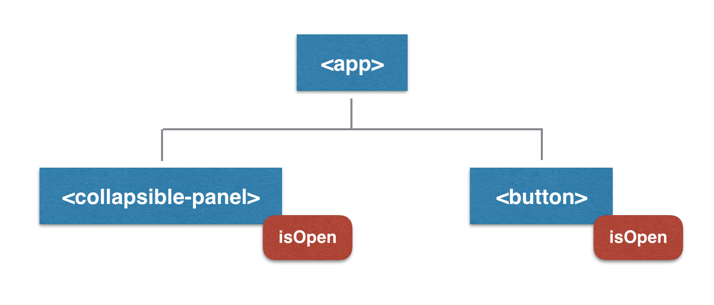

One of the biggest challenges when writing a JavaScript application is keeping multiple parts of the interface in sync. A user interaction in one part of the interface often affects data in another. If not managed well, this data can end up in multiple places, but with inconsistent values.


_Email 1 being unread is a piece of application state that affects multiple parts of the interface. After the email is read, the title should no longer be bold, and and Inbox unread count should decrease by one._

In the past few years, the JavaScript community has learned a lot about how to deal with this problem. The solution involves the principle of the **Lowest Common Ancestor**. To explain this principle, let's look at some interface elements you might build while working on a real-world application.

The examples use Ember, but the principles are high level and apply to any technology used for building long-lived JavaScript applications.

## A collapsible panel (a single view of app state)

Let's say we're building an app with a collapsible panel:


_A collapsible panel, an element that opens and closes when the user clicks on it._

Here's the component's template:

```hbs
<a {{action 'toggleIsOpen'}}>
  Panel Title
</a>

{{#if isOpen}}
  <div>Anim pariatur cliche...</div>
{{/if}}
```

If the panel `isOpen`, we'll show the body. Clicking the title triggers the `toggleIsOpen` action.

Here's the component's JavaScript:

```js
export default Ember.Component.extend({
  isOpen: true,

  actions: {
    toggleIsOpen() {
      this.toggleProperty("isOpen")
    },
  },
})
```

The default value of `isOpen` is `true`, so the panel starts out open. Whenever a user clicks the title, `isOpen` toggles between `true` and `false`.

---

Currently, our application looks like this:


`isOpen` is the only piece of state in our application that changes. Further, the collapsible panel is the only part of the interface that needs to know about it. Because of this, it makes sense for the panel itself to "own" this piece of application state. So, we'll leave `isOpen` right where it is - as a simple property on the component.

## Adding a button (multiple views of app state)

We have a new feature request: adding a separate button which can also toggle the panel. The button should also say "Expand" or "Collapse", depending on the state of the panel.


_A collapsible panel and a button, which both depend on the same state._

We now have two elements in our application whose view depends on the same piece of state. What should we do?

One option is to add an `isOpen` property to our `<button>` component, and try to keep both properties in sync:



But, duplicating state like this is not a good solution, because it can easily lead to an inconsistent interface.

A better solution is to move the state up a level to `<app>`, and have `<app>` pass down `isOpen` to both `<collapsible-panel>` and `<button>`:


Think of the `isOpen` properties on the two children as read-only pointers to the `isOpen` property on `<app>`. Now, both `<collapsible-panel>` and `<button>` are guaranteed to stay in sync, since they're rendered from the same state.

Here's the template for `<app>`:

```hbs
{{collapsible-panel isOpen=isOpen onClick=(action 'toggleIsOpen')}}

{{button isOpen=isOpen onClick=(action 'toggleIsOpen')}}
```

And here's the JS, which looks exactly the same as `<collapsible-panel>` did in the first example:

```js
export default Ember.Component.extend({
  isOpen: true,

  actions: {
    toggleIsOpen() {
      this.toggleProperty("isOpen")
    },
  },
})
```

When the user clicks either the `<collapsible-panel>` or the `<button>`, we'll send an action up to `<app>`, which will then change its `isOpen` property. The new value of `isOpen` propogates throughout the rest of the app, and the problem of inconsistent interface elements goes away.

Crucially, we've made sure that only the owner of the state - `<app>`, in this case - is able to change that state. The children delegate their actions up to the owner.

---

By moving the state up to `<app>` and giving `isOpen` a single source of truth, we were able to ensure that `<collapsible-panel>` and `<button>` would never fall out of sync.

In the example above, `<app>` was the _only_ ancestor of both components in our component tree. Say we had a larger app:


In this case, it would be sufficient to move `isOpen` to `<main>` to ensure `isOpen` had a single source of truth.

Now, a definition. Given a set of components, the _Lowest Common Ancestor_ of this set is the component that's deepest in the UI tree but still above each component in that set.

This definition along with the discussion above leads us to the following general principle:

> _When dealing with changing application state that lives in your UI hierarchy, store that state in the **Lowest Common Ancestor** of all components that need it._

Storing shared state on the LCA, and then having that common ancestor pass its state to the relevant children, ensures that the state will have a single source of truth, and that every component that renders from that state will stay in sync.

Note that it can sometimes be convenient to create a new common ancestor component, just for the sake of owning and managing the shared state.

## Adding a logout button (pulling app state out of the UI)

In many situations, the principle of LCA is sufficient. State has a single source of truth, and is passed down to all children who need it. The problem you can run into, however, is when the LCA is very far away in your component hierarchy from the relevant children.

In this case, you can end up with many components acting as middlemen. These components must know about and pass along various pieces of shared state to leaf components, making your UI difficult to refactor. There's even a [code smell of the same name](https://sourcemaking.com/refactoring/smells/middle-man) in object-oriented design, suggesting that this is indeed a concern.

An example of how this could happen is if many components in your app needed to know about the current user:


_In this app, many components need to know about the current user._

Assuming this many nodes need to know about the current user, the LCA would be `<app>`, and every component would need to pass along `currentUser` to every other component. This definitely smells like Middle Man.

The solution to this problem is to _pull the state out of the UI hierarchy_. The idea here is that, while `isOpen` in our earlier example corresponded directly to a particular onscreen UI element (whether the panel was open), `currentUser` does not. So, it doesn't really make sense for `<app>` (or any other UI element) to "own" `currentUser`.

In Ember, we can use a Service to solve this problem (in React, you might use a Flux store). A Service is a long-lived data container that exists independent of the UI tree. After we set it up, components can use _dependency injection_ to ask for the data in the Service. Importantly, their parent components are none the wiser.

```js
// app/services/current-user.js
export default Ember.Service.extend({

  name: 'Bob',
  email: 'bob@acme.com'

});

// app/components/sidebar.js
export default Ember.Component.extend({

  currentUser: Ember.inject.service('current-user')

});
```

Now, `<sidebar>` can access `currentUser` in its template:

```hbs
<h2>{{currentUser.name}}</h2>
```

`<sidebar>` has become more self-contained, making it easier to move around in the UI in later refactorings.

## Conclusion

So, when should application state exist in the UI hierarchy, and when should it be pulled out? As in most areas of software design, there is no black and white answer. Instead, we must understand the tradeoffs involved, and make decisions on a case-by-case basis.

State that's stored directly in the UI hierarchy is often easier to understand and requires less boilerplate; but, the more components that need a particular piece of state, the more brittle your UI hierarchy becomes. Eventually, it makes sense to move "popular state" into a UI-independent data container, an identity map which other components can read from.

The key insight is that _all changing application state should have a single owner_, and thus a single source of truth. Further, only the owner should be allowed to mutate that state. If the state lives in the UI hierarchy, the single owner should be the Lowest Common Ancestor of all components that need that state.

To summarize,

1. Start by storing state on local component instances
2. Once a piece of application state is needed by more than one component, move that state up to the LCA
3. Once there are many components acting as middlemen, or it feels wrong for any particular component to own some state, pull that state out of the UI hierarchy and into a data container (an Ember Service, a Flux store, etc.)

While our example above might seem simple enough, this pattern goes a long way in keeping your application's architecture consistent and easy to reason about.
