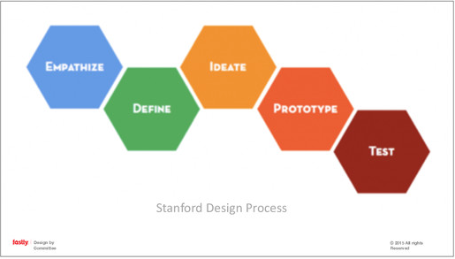
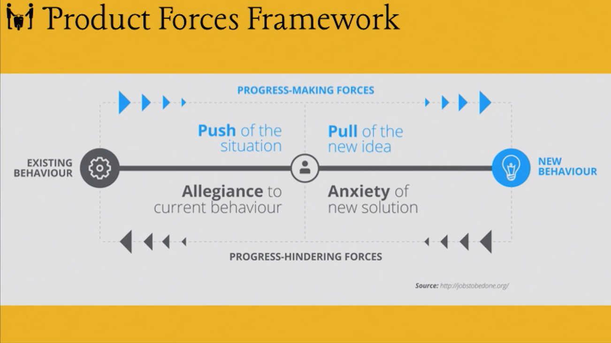

Here are notes from some of the sessions I attended at [UX Burlington 2015](http://uxburlington.com/) earlier this year.

- Designing with Empathy
- Don't fear the research!
- Improving the Authoring Experience
- Making Design by Committee Work
- Scaling UX
- Why Enterprise software sucks (and how to unsuck it)

---

## Designing with Empathy

by [Katie McCurdy](https://twitter.com/katiemccurdy)

- Conduct interviews and observe, ideally in users' own environments
- Participatory design. Bring users in early on in the design process. Output is an artifact that you can use during design.
  - For example, asked patients to draw their symptoms on a body. Insight: patients used shapes to indicate sensation on their body (star for sharp pain).
- Usability testing
  - Can be cheap and fast
  - Purpose: to find out if your product is usable
    - For example, used the color red for a health app. Diabetics saw this as guilt-inducing.
- Building trust is key

---

## Don't fear the research!

by [Eva Kaniasty](https://twitter.com/kaniasty)

- Design is not easy. There's a huge fear of failure.
- Designers see input from users as bad news
- There are three fears:
  - Usability testing. The fear here is, you're ultimately testing the people who did the design.
  - Fear of change
  - Fear of wasting time and money
- Rewards for doing user research:
  - Improved process ("agile"). Linear is easier, but iteration is actually better.
  - Good decisions
  - Fun! (esp when people are involved)
- Henry Ford quote, users didn't know what they wanted
  - Well, we don't ask people what they want either, but we do ask them about their feelings, their frustrations etc.
  - Is it intuitive?
  - Is it compelling?
  - Empathy helps us get there
- Research saves time and money
  - 40% of dev time is spent reworking existing designs
  - Fixing an error after development is up to 100 times as expensive as before
- Case studies
  - Two different companies came to Eva for user research
  - First came through a design agency. The user research had little impact, in large part because the design agency (rather than the actual client) was in control
  - Second client came directly to Eva, and the research had a big impact
  - Lessons learned:
    - Startups tend to not want external research, but an outside perspective can be very valuable
    - Don't rely on others to be your advocate. You know best about the value you can bring
  - Ultimately, communication and collaboration between design and research is crucial for success
  - Trust is also crucial. Don't just let your reports speak for themselves. Use direct contact to convince the client.
- Overcome fears
  - Connect
  - Collaborate
  - Iterate

---

## Improving the Authoring Experience

by [Eileen Webb](https://twitter.com/webmeadow)

We work hard to make our websites beautiful, intuitive and responsive. But backend content authors can break our designs! Long headlines, images with unexpected aspect ratios and non-complementary colors are just some of the things that can cause our bespoke layouts to break down.

One might be tempted to blame the authors, or even the layouts, but in fact the **authoring tools** themselves are often to blame. We spend weeks refining our site's ux for our end users, but we throw very little thought and energy towards building an intuitive and user-friendly CMS solution for our content authors. This is a huge problem. We don't user test and iterate our authoring tools - even though authors are the people who will be using our site the most!

A first step is to write **content guidelines** for your site. Content guidelines are simply instructions and suggestions to help your authors write good content. They could be suggestions about tone and voice, recommendations for an image size or dominant color, or reminders about the target audience.

It's also important to identify your **content model**. Think of a content model as a template for your content. For example, say you're building a cooking site where users can post recipes. Instead of thinking of a recipe as a big chunk of text, identify the common pieces:

- a title
- ingredients
- the directions
- serving size
- difficulty

Having this structure is invaluable to building an authoring platform that will help authors produce consistent, high-quality content.

**Guidelines**

When writing help guidelines, don't write too much. Small hints are usually enough to nudge authors in the right direction:

- _Names give context._ Instead of title, "Event Title". Instead of description, "Event information."
- _Editorial: what are we saying?_
- _Format: how are we saying it?_ Field length.
- _Images._ Format shape, size, art direction, how will it be used (e.g. as a thumbnail?)
- _Display._ Where does this content go? Does it end up in a sidebar? In a "Related events" slider? Authors need this information to make good decisions.

Build content guidelines _with your team_:

- Use designers and developers - good ideas often come from where you least expect it!
- Marketers and your content team should also be involved.
- QA and customer service teams know what frustrates users the most. This information is highly relevant to writing useful guidelines.

Where's the best place for these guidelines? Probably not a PDF. Ideally, right next to the content fields themselves. Essentially, apply the same UX principles you would if these tools were user-facing - because they are!

Ultimately, talk to your team, and build authoring tools _with_ them, not _for_ them. Iterate with your team early on and often. **The fear of sharing work in progress is a valid fear - but it's holding you back.**

---

## Making Design by Committee Work

by [James A. Rosen](https://twitter.com/jamesarosen)

This talk will explore some lessons learned from a large UI redesign.

**Start with empathy for the user**

Product featuritis. The Pontiac Aztec is one of the "worst cars of all time". Design committee used focus groups, but the product fell flat.

Why does Featuritis occur? Product teams often dive in too late in the design process:

Many start at Ideate instead of Empathize.

Don't let the funder of a product cloud who you're building the product for! Focus on solving your **user's** problems.

**The importance of emotional intelligence**

> "Groups are most creative when ...there is mutual trust." - Druskat & Wolff

Emotional IQ is, essentially, how in touch you are with your own emotions. How can you build it? Practice _mindfulness_. I am frustrated vs. I _feel_ frustrated. Practice experiencing your emotions without letting them control you.

**Cognitive biases**

Psychologists, behavioral economists and others study _biases_, phenomena that can affect us without our even knowing it. Here are some popular ones:

- **Egocentric** - thinking others are like ourselves
- **Planning Fallacy** - poor planning because we're bad at combining probabilities
- **Dunning-Kruger effect** - unskilled people overestimate their ability
- **Framing effect** - drawing different conclusions based on how the problem/text is framed (90% success rate vs 10% failure rate for a sugery)
- **Bias blind spot** - our ability to see cognitive biases in others, but not ourselves

One idea to eliminate these biases is using groups of people. This does help with certain issues, but with others, groups can actually exacerbate the problem. For example, groups often avoid talking about failure. They also tend to be overconfident.

**Cascade effects**

There are also biases that occur _only_ in groups. **Cascade effects** are pressures exerted on an individual by a group, which can sway the individual's opinions. For example, a judge may change their opinion when they hear that the other three judges voted the same verdict.

Why does this happen? Because individuals often want to be seen as being in line with the group. Gender can even play into this. Men often self-censor on fashion, and women on sports.

In the context of a design meeting, one way to overcome these group biases is to have everyone design and ideate independently for 10 minutes, and then go around the room and give everyone time to present their own ideas.

**Common Knowledge Focus**

People tend to focus on what "everybody knows." Instead, have a process to invite cognitively different people to share their perspective. - For example, ask non-UX users their opinion _explicitly_.

**Contention & Loss of Focus**

- Lateral thinking - [Duncker's Candle Problem](http://www.wikiwand.com/en/Candle_problem)
- Socractic dialog - often used by groups, but can lead to (1) annoyance and (2) loss of focus
- **Parallel Thinking** can overcome these problems.

  1. State the problem
  2. Propose a solution
  3. Everyone lists pros. (Instead of offerring alternatives. They're thinking positively, and aligned emotionally.)
  4. Everyone lists cons
  5. Everyone lists ways to mitigate cons

  What's the result? Everyone feels _heard_, and ideas are explored more thoroughly.

**Tips to boost your creative team**

- Meditate for 10 minutes a day, for two weeks
- Talk to _real users_ of the product
- Prime your creativity before meetings (e.g., with [30 circles](http://www.skills21.org/2013/01/jumpstart-creativity-with-the-30-circles-challenge/) and Use My Line)

- Generate ideas _independently_, then reveal _simultaneously_
- Remix. Say one thing you really like about a design that wasn't yours.
- Analyze critically

**Resources**

- "Search Inside Yourself," by Chade-Meng Tan (Googler)
- "Building the Emotional Intelligence of Groups," by Vanessa Urch Druskat and Steven B. Wolff ([link](https://hbr.org/2001/03/building-the-emotional-intelligence-of-groups))

---

## Scaling UX

by [Jeffrey Pierce](https://twitter.com/jeffrey_pierce)

How can we keep UX the focus of a growing organization? We need a set of tools, practices and guidelines. Let's look at five stages.

**Stage 1: Research.** Find your project's stakeholders, and figure out what they want.

- Instead of simply building desired **outputs**, focus on desired **outcomes**.
- Above all, listen. And take good notes! One way to do this, use a sharpie on small yellow stickes. This is the level of fidelity you should want during a brainstorming session - forces you to distill a request down to its essence.
- Then, organize your stickies using this grid:

                                 Delight
                                    |
                                    |
                                    |
                                    |
                                    |
         Unnecessary---------------------------------------Necessary
                                    |
                                    |
                                    |
                                    |
                                    |
                                  Disgust

    This will help you prioritize your stakeholders' desired outcomes.

**Stage 2: Requirements.** Get out of the building, and talk to people. Ask open-ended questions. Ask about past experiences. Keep them talking - "Tell me more."

- You'll find that some of your ideas fall flat. _Talking to users forces you to reassess the assumptions and expectations you have about your product._

**Stage 3: Design.** Run a design session. Get a group of people. The purpose here is to generate as many ideas as possible. Get all sorts of users, developers, designers, product people. Then

1. Start with 8-ups. Fold an 8.5 x 11 piece of paper in half three times, and ask everyone to sketch what they'd like the app to do. Sandbox to 10 minutes. Very low-fidelity, purpose is to just get ideas.

   - Then, get feedback on everyone's designs

2. Do it again, but with 2-ups. Fold the paper in half once. Allow some time for higher fidelity sketches. Get feedback again.

3. Then, move to wireframing.

**Stage 4: Development.** _Measure_ your future goals. Try to get both quantitative and qualitative measures. Create workable prototypes via Keynote.

Ultimately, when scaling UX, the only non-negotiable principle is communication.

---

## Why Enterprise software sucks (and how to unsuck it)

by [Rian Van Der Merwe](https://twitter.com/RianVDM)

- Why does it suck?
  1. Lack of empathy. You sell software to someone who wants control, configurability and customization, compliance... But the users just want to _get stuff done_.
     - As fewer people are able to use it, fewer people want to, until nobody does
     - Need to build for the job _our users wants to accomplish._
  2. Too much legacy
     - **Waterfalls**. Spirit of agile.
     - Sprints do not mean agile.
       - Silos in an org
       - Too many people need to get involved to ship anything
     - Bureaucracy
- The dysfunction in the organization becomes the dysfunction in the product, and that gets passed onto the customer.

- How to solve this?
  1. Show the business the value of design
     - Market cap of design-driven companies (translate: more \$)
     - Cost savings. The cost of making changes is dramatically different during design (1x) development (6x) and after launch (100x) (source: Software Engineering: A Practitioner's Appraoch)
  2. Shrink user-centered design to fit
     - "We don't have time up front." What about the inevitable phase 2?
     - Everything is on a scale, do what you can with the resources you have
     - From more costly to less costly:
       - _Exploration:_ Studies, interviews, asking a friend
       - _Prototyping:_ HTML, clickable prototype, paper sketch
       - _User testing:_ formal, Starbucks
  3. Turn sales into a product design function. Product Forces framework gives us a common language to talk about this (jobstobedone.org)
     - Product forces: push of a situation, pull of the new idea
     - Allegiance to current behavior, anxiety of new situation
  4. Break down silos + encourage collaboration
     - Start with product discovery
     - Run a design studio. Get people together, design indepedently, share simultaneously.
     - Do user research

- Process leads to better Enterprise software
- More about facilitation than design
- Show them why it's important
  - You're not going to make their lives difficult
  - Give them a framework that covers the whole product
  - Make them part of the process
  - **Avoid politics, include people**
